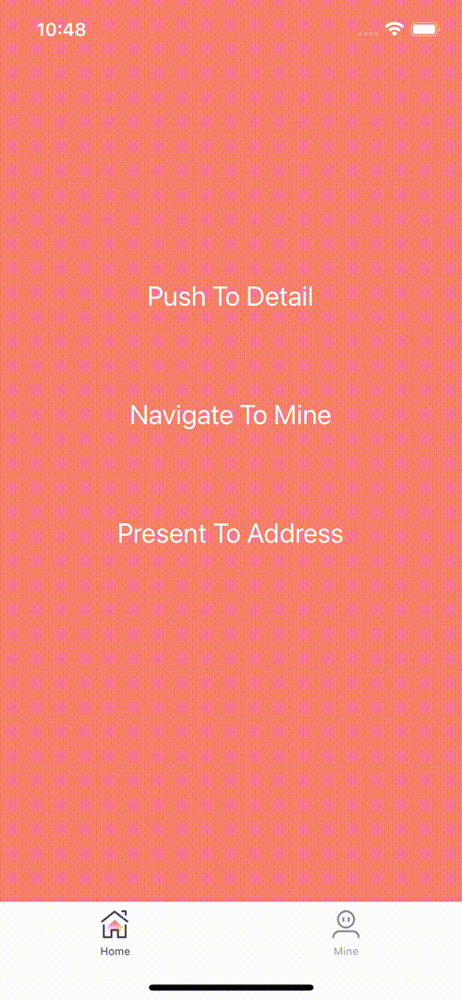

- 纯原生的导航跳转组件
- 转场动画, 点击导航返回按钮和点击最下面标签 TabBar 都是原生的事件, 性能做到和原生一致
- 给 HTRouteView 绑定页面参数, 当点击的时候直接原生响应跳转绑定的页面
- 支持 presentModalController 模态弹出页面, 可以自定义弹出的页面大小动画等等
- 支持 componentDidAppear componentDidDisappear 生命周期
- 支持每个页面的 AOP 日志收集
- 留出来的接口和 react-navigation 一致, 方便切换



## Usage

[点击查看完整示例 Example](./example/app/App.js)

```bash
yarn add 'https://github.com/hellohublot/react-native-route.git'
```
#### iOS
```objective-c
- (BOOL)application:(UIApplication *)application didFinishLaunchingWithOptions:(NSDictionary *)launchOptions {

	...

	[HTRouteBridgeManager loadBridgeWithURL:[self sourceURLForBridge:nil] moduleName:@"ReactNativeDemo" launchOptions:launchOptions];

	UITabBarController *tabBarController = [[UITabBarController alloc] init];
	tabBarController.tabBar.backgroundColor = [UIColor whiteColor];

	NSString *titleKey = @"title";
	NSString *imageKey = @"image";
	NSString *selectedImageKey = @"selectedImageKey";
	NSString *componentKey = @"component";
	NSArray *keyValueList = @[
		@{ titleKey: @"Home", imageKey: @"tabbar_home", selectedImageKey: @"tabbar_home_selected", componentKey: @"Home" },
		@{ titleKey: @"Mine", imageKey: @"tabbar_mine", selectedImageKey: @"tabbar_mine_selected", componentKey: @"Mine" },
	];
	[keyValueList enumerateObjectsUsingBlock:^(NSDictionary *dictionary, NSUInteger index, BOOL * _Nonnull stop) {
		HTRouteController *routeController = [HTRouteController controllerWithComponentName:dictionary[componentKey] componentRouteOptionList:@{@"id": [NSString stringWithFormat:@"%ld", index]}];
		UINavigationController *navigationController = [[UINavigationController alloc] initWithRootViewController:routeController];
		navigationController.fd_viewControllerBasedNavigationBarAppearanceEnabled = false;
		[tabBarController addChildViewController:navigationController];

		routeController.tabBarItem.title = dictionary[titleKey];
		routeController.tabBarItem.image = [[UIImage imageNamed:dictionary[imageKey]] imageWithRenderingMode:UIImageRenderingModeAlwaysOriginal];
		routeController.tabBarItem.selectedImage = [[UIImage imageNamed:dictionary[selectedImageKey]] imageWithRenderingMode:UIImageRenderingModeAlwaysOriginal];
	}];

	UIViewController *rootViewController = [[UIViewController alloc] init];
	rootViewController.view.backgroundColor = [UIColor whiteColor];
	[rootViewController addChildViewController:tabBarController];
	[rootViewController.view addSubview:tabBarController.view];
	[tabBarController didMoveToParentViewController:rootViewController];

	self.window = [[UIWindow alloc] initWithFrame:[UIScreen mainScreen].bounds];
	self.window.rootViewController = rootViewController;
	[self.window makeKeyAndVisible];
	return YES;
}
```
#### Android.MainApplication
```java
	public void onCreate() {
		super.onCreate();
		...
		HTRouteGlobal.application = this;
		HTRouteGlobal.moduleName = "ReactNativeDemo";
		getReactNativeHost().getReactInstanceManager().createReactContextInBackground();
	}
```
#### Android.MainActivity
```java
private HTRouteTabBarController tabBarController;

@Override
protected void onCreate(Bundle savedInstanceState) {
	super.onCreate(savedInstanceState);
	if ((getIntent().getFlags() & Intent.FLAG_ACTIVITY_BROUGHT_TO_FRONT) != 0) {
		finish();
		return;
	}
	setReactNativeContentView();
}
private void setReactNativeContentView() {
	HTRouteGlobal.activity = this;
	this.tabBarController = new HTRouteTabBarController() {
		private Map createComponentRouteOption() {
			final int count = modelList.size();
			Map<String, Serializable> componentRouteOption = new HashMap() {{
				put("id", count);
			}};
			return componentRouteOption;
		}
		@Override
		public void initDataSource() {
			modelList.clear();
			modelList.add(
			    new HTRouteTabBarModel("Home", R.mipmap.tabbar_home, R.mipmap.tabbar_home_selected,
			        new HTRouteNavigationController(new HTRouteController("Home", createComponentRouteOption())))
			);
			modelList.add(
			    new HTRouteTabBarModel("Mine", R.mipmap.tabbar_mine, R.mipmap.tabbar_mine_selected,
			        new HTRouteNavigationController(new HTRouteController("Mine", createComponentRouteOption())))
			);
		}
	};
	setContentView(this.tabBarController.getView());
}

@Override
public void invokeDefaultOnBackPressed() {
	HTRouteNavigationController selectedFragment = (HTRouteNavigationController) tabBarController.findSelectedFragment();
	if (selectedFragment.childControllerList.size() > 1) {
		selectedFragment.popViewController(true);
	} else {
		moveTaskToBack(true);
	}
}
```
### Android.res.value.style.xml
```xml
<style name="AppTheme" parent="Theme.AppCompat.DayNight.NoActionBar">
	// fullscreen
	<item name="android:windowTranslucentStatus">true</item>
</style>
```

#### App.js
```javascript
import { HTRouteManager, HTRouteComponent, HTRouteView, HTNavigationBar } from 'react-native-route'

HTRouteManager.register({
	'Home': () => require('~/page/Home').default,
	'Mine': () => require('~/page/Mine').default,
})
HTRouteManager.defaultRouteNavigationRender = (props) => {
	const readComponentOptionsFromProps = (props) => {
		let componentClass = HTRouteManager.readRegisterFunction(props)()
		let navigationOptions = componentClass?.navigationOptions ?? {}
		if (typeof(navigationOptions) == 'function') {
			let _navigationOptions = navigationOptions(props) ?? {}
			navigationOptions = _navigationOptions
		}
		navigationOptions = { ...navigationOptions }
		return navigationOptions
	}
	let navigationOptions = readComponentOptionsFromProps(props)

	// header
	if ((navigationOptions.hasOwnProperty('header') && navigationOptions.header == null) || navigationOptions.headerShown == false) {
		return null
	}

	// header item
	let leftItemList = [
		<HTRouteView style={{ paddingRight: 30, height: '100%', justifyContent: 'center' }}
			routeData={props.navigation.createRouteData('pop')}
		>
			<Image source={require('~/img/back_white.png')} />
		</HTRouteView>
	]
	if (navigationOptions.header_left) {
		leftItemList = [ navigationOptions.header_left ]
	}

	// title
	if (!navigationOptions.title) {
		navigationOptions.title = navigationOptions.headerTitle
	}
	navigationOptions.backgroundColor = navigationOptions.headerBackgroundColor
	

	return (
		<HTNavigationBar
			backgroundColor={'white'}
			titleStyle={{ color: 'white', fontSize: 20 }}
			leftItemList={leftItemList}
			{...navigationOptions}
		/>
	)
}


export default class App extends Component {

	render() {
		return (
			<HTRouteComponent
				{ ...this.props }
			/>
		)
	}

}

```

## Author

hellohublot, hublot@aliyun.com
